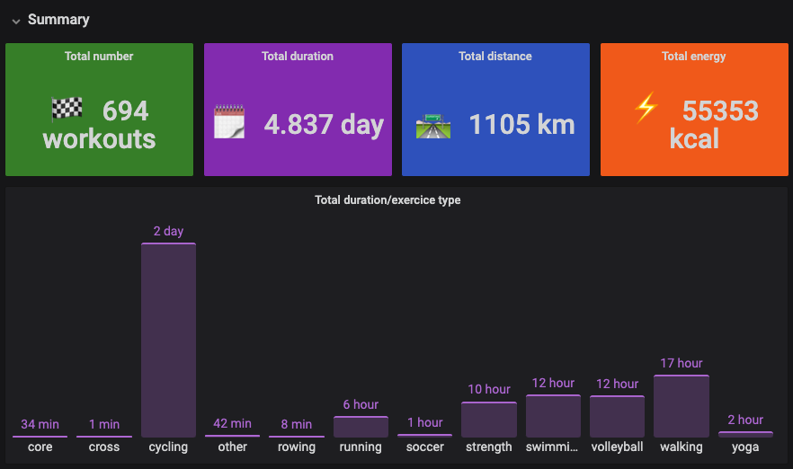
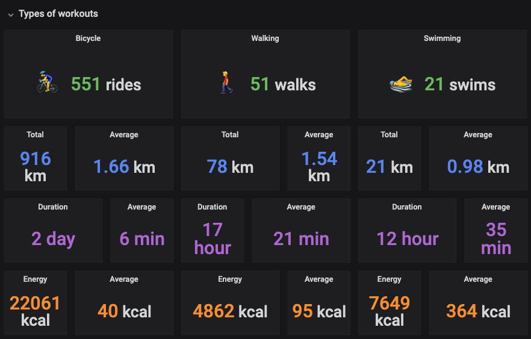
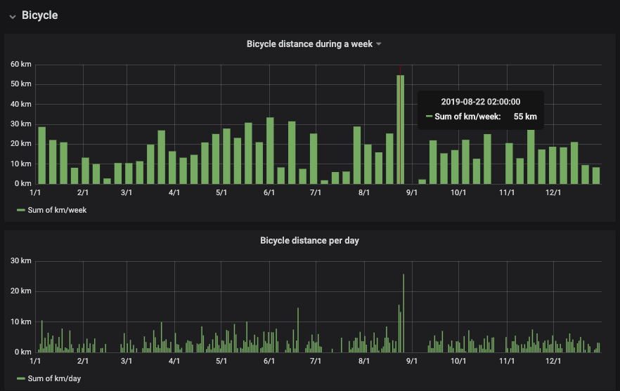

# Welcome to Apple Watch Workouts year review 👋

[](https://github.com/yannbertrand/apple-watch-workouts-year-review/actions/workflows/test.yaml)

[](./license)
[](https://x.com/_YannBertrand)

**Stability: 1 - Experimental**

> Visualize your Apple Watch workouts of the year in a Grafana dashboard

## ✨ Demo





## 🏗 Install

Clone the repo using Git. You'll need Docker, Node.js (tested with v22)

```sh
npm ci
```

## 🚀 Usage

The project runs an InfluxDB database and a Grafana instance, launch them with docker compose:

```sh
docker compose up -d
```

In the meantime, export your Apple Watch data from your iPhone. In the Health App:


Send the zip file to your computer.

Then run:

```sh
npm start <path_to_export.zip>
```

Grab a coffee while your data is read and inserted in InfluxDB (my data takes more than a minute to be loaded)!

📈 Once the script ends, your Grafana dashboard should be available at http://localhost:3000/d/apple-watch-workouts/year-dashboard?orgId=1.

**This dashboard is just a proof of concept**, take full advantage of Grafana, try to edit the panels and even add yours if you want to!

## ❓ Questions

### How do I use this with another tracker?

The project has been specially designed for the Apple Watch Health data.

### How do I replace a chart?

Please go to [Grafana documentation](https://grafana.com/docs/grafana/latest/features/panels/singlestat/) and have fun exploring 😊.

### Why is my preferred activity not displayed?

Because I didn't take time to find them automatically (cycling, walking, running, swimming, strengh training and volleyball are hardcoded). Contributions are welcome!

### How do I update my data?

You'll have to export the zip file and run `npm start export.zip` again.

### I got an error while running `npm start export.zip`, what should I do?

If you have this kind of error:

```bash
    throw new Error(`${workoutActivityType} workoutActivityType not handled yet`);
    ^

Error: HKWorkoutActivityTypeNonExistingActivityType workoutActivityType not handled yet
```

You'll have to add the workout type to the list in `./lib/mapper.js`, please open a PR if you have to do it.

For any other error, please [open an issue](https://github.com/yannbertrand/apple-watch-workouts-year-review/issues/new) (or make [a PR](https://github.com/yannbertrand/apple-watch-workouts-year-review/pulls) if you know how to fix it!).

## 🚧 Run unit tests

```sh
npm test
```

## Show your support

Give a ⭐️ if this project helped you!

---

_This README was generated with ❤️ by [readme-md-generator](https://github.com/kefranabg/readme-md-generator)_
